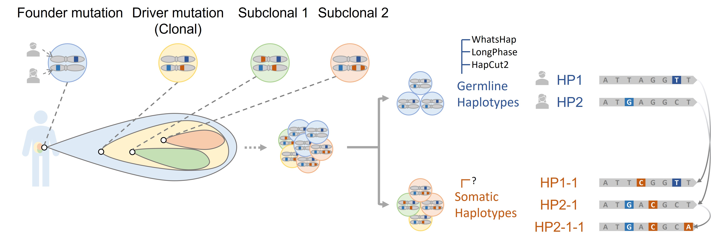

# Introduction

Cancer is, at its core, a disease of the genome, characterized by the accumulation of genetic and epigenetic alterations that drive the transformation of normal cells into malignant counterparts&nbsp;[@machlowska2020; @sun2022; @recillastarga2022]. These alterations are broadly categorized by their origin into two distinct types. Germline variants, which are inherited from parental lineages, are present in virtually every cell from birth and can be transmitted to subsequent generations. In contrast, somatic variants are acquired within the cells of a specific tissue during an individual's lifetime, arising from endogenous processes such as DNA replication errors or from exposure to exogenous mutagens (@fig:int-page-3-cropped-jpg). The progressive accumulation of these somatic variants is the primary driver of tumorigenesis, leading to uncontrolled cell proliferation and the evolution of a complex neoplastic mass&nbsp;[@sonnenschein2013]. A precise characterization of the somatic mutation landscape within a patient's tumor is therefore essential for accurate diagnosis, prognosis, and the design of targeted therapies that form the basis of precision oncology.

{#fig:int-page-3-cropped-jpg}

A central yet challenging aspect of characterizing this genomic landscape is the determination of haplotype phase. A haplotype is defined as the specific sequence of alleles co-located on a single chromosome that are statistically associated and typically inherited as a single unit&nbsp;[@duitama2023; @xie2022; @zeng2024]. Although an individual'$s$ diploid genome is composed of two constitutional haplotypes—one paternal and one maternal—the acquisition of somatic mutations during oncogenesis gives rise to novel, tumor-specific haplotypes within the evolving cancer cell population. The computational process of assigning alleles to their haplotype of origin is known as phasing. Ascertaining whether multiple somatic mutations occur on the same haplotype (*in cis*) or on different parental haplotypes (*in trans*) has profound clinical implications. In Non-Small Cell Lung Cancer (NSCLC), for example, the relative phasing of the L858R and T790M mutations in the *EGFR* gene is a direct determinant of therapeutic strategy. Tumors with *in trans* mutations may respond to first-generation tyrosine kinase inhibitors (TKIs), whereas those with *in cis* mutations exhibit resistance, requiring treatment with third-generation TKIs. This example underscores the clinical imperative for developing robust methods capable of resolving somatic haplotypes to inform effective therapeutic decisions.

{#fig:int-page-7-cropped-jpg}

The emergence of long-read sequencing technologies, developed by firms such as Pacific Biosciences (PacBio) and Oxford Nanopore Technologies (ONT), offers new opportunities for resolving complex genomic structures, including haplotypes&nbsp;[@pucker20221; @ebbert20191]. In contrast to short-read technologies, which generate fragments of only a few hundred base pairs, long reads can span tens of thousands of bases and thereby encompass multiple variant sites within a single sequenced molecule&nbsp;[@ebert2021; @hamim2022; @sierra2024]. This intrinsic feature makes long-read data particularly well-suited for phasing. Nevertheless, a common scenario in both clinical and research settings involves the analysis of sequencing data from a tumor specimen alone, without a matched normal sample from the same individual. This "tumor-only" paradigm presents a formidable analytical challenge. The absence of a constitutional germline reference makes it difficult to differentiate pre-existing germline variants from newly acquired somatic mutations, a critical distinction that complicates subsequent analyses, including haplotype phasing.

The analysis of tumor-only long-read data is further complicated by two intrinsic properties of cancer genomes: large-scale structural variations and intra-tumor heterogeneity. A frequent event in many cancers is chromosome-scale Loss of Heterozygosity (LOH), a state in which a large genomic region or an entire chromosome arm loses one of its two parental copies. Existing phasing algorithms are often ill-equipped to model such profound allelic imbalances, which can lead to fragmented and erroneous haplotype reconstructions that fail to capture the contiguous nature of the LOH event (@fig:int-page-8-cropped-jpg). Concurrently, tumor specimens are rarely composed of pure neoplastic cell populations; instead, they are typically heterogeneous mixtures of malignant cells and non-malignant stromal and immune cells&nbsp;[@sempere2010]. The proportion of tumor cells in this admixture, referred to as tumor purity, is a critical variable. In samples with low purity, the genomic signal from normal cells can obscure the signal from tumor-specific variants, introducing ambiguity that precipitates critical phasing artifacts, most notably "switch errors," wherein the algorithm incorrectly alternates between tumor and normal haplotypes (@fig:int-page-9-cropped-jpg).

{#fig:int-page-8-cropped-jpg}

{#fig:int-page-9-cropped-jpg}

These challenges are not independent but are deeply interconnected facets of tumor biology that necessitate a unified analytical approach. A fragmented strategy, wherein tumor purity estimation, LOH detection, and haplotype phasing are performed as separate, sequential steps, is susceptible to the propagation of errors between stages. This can ultimately yield an inaccurate representation of the tumor'$s$ genomic architecture. Consequently, the accurate reconstruction of somatic haplotypes requires a sophisticated computational model capable of simultaneously accounting for the confounding effects of tumor purity and large-scale LOH. By jointly estimating these parameters, such an integrated model can effectively deconvolute the mixed signals within the sequencing data and, critically, leverage the distinct allelic patterns in LOH regions to enhance, rather than impede, the accuracy of the phasing process.

This thesis addresses the critical need for improved somatic haplotype reconstruction from cancer genomics data. The central objective of this research is to develop and validate a novel computational framework for the **Joint Somatic Phasing and Purity Estimation Incorporating Loss of Heterozygosity in Tumor-Only Long-Read Sequencing**. By implementing an integrated statistical model that explicitly addresses the interdependent challenges of LOH and sample purity, this work seeks to overcome the limitations of current methods. The successful development of this framework is poised to enable a more accurate and comprehensive characterization of the somatic haplotype landscape in tumors, thereby providing crucial insights for both fundamental cancer research and the clinical application of precision medicine.